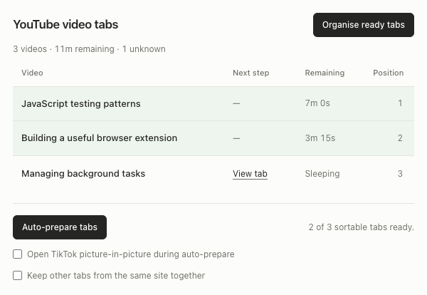

# TabSort for YouTube

[](https://github.com/MrLawrenceAwe/TabSort/actions/workflows/ci.yml)

Chrome extension that keeps YouTube video tabs organised by the time you still have left in each video. It tracks watch and shorts tabs in the current window, gathers the remaining playback times and lets you organise the ready tabs with one click.



*Preview uses synthetic tab titles and playback times.*

## Install (unpacked)

1. Clone or download this repository.
2. Run `npm install` and `npm run build`.
3. Visit `chrome://extensions`, enable **Developer mode**, and choose **Load unpacked**.
4. Select the project directory.

For a packaged copy, run `npm run package`, extract the ZIP from `release/`, and
select the extracted directory when loading the unpacked extension.

## Quick walkthrough

1. Open several YouTube videos in the same Chrome window.
2. Open TabSort to see remaining playback times and any tabs needing attention.
3. Choose **Auto-prepare tabs** to prepare eligible tabs while you keep browsing.
4. Choose **Organise tabs** or **Organise ready tabs** to sort the available videos.

See [the usage guide](docs/usage.md) for sleeping tabs, session recovery and Stop behaviour.

## Engineering highlights

- Separates the extension worker, YouTube content runtime, popup and preparation queue.
- Uses a session journal to return tabs after worker interruption and caches prepared playback readings.
- Tests cover sorting, browser events, playback evidence and tab-group restoration.

## Development

Requires Node.js 22+ and Chrome for installation. For automated browser tests, install Chromium first:

```sh
npm ci
npx playwright install chromium
npm run check
npm run package
```

See [development and architecture](docs/development.md). CI installs Chromium before running the complete check suite and uploads the packaged extension.

For a synthetic popup preview without installing the extension, serve the repository with `python3 -m http.server 8766 --bind 127.0.0.1` and open `/docs/preview.html`. The preview reuses the popup markup with fixed synthetic data and mock browser APIs; its buttons do not operate real tabs.

## Permissions and privacy

TabSort performs all processing locally and does not send browsing data to a server.

- `tabs` reads tab URLs and positions, activates or reloads a requested tab, and reorders tabs.
  URLs outside YouTube are only used locally when the optional “Keep other tabs from the same site together”
  setting is enabled.
- `tabGroups` moves existing groups intact when sorting, preserving their membership and appearance.
- `alarms` refreshes eligible playback information periodically while the extension service
  worker is available.
- `scripting` reinjects the bundled YouTube runtime if Chrome reports that a tab has no content
  script receiver.
- `webNavigation` detects YouTube single-page navigation reliably.
- `storage` saves the grouping preference using Chrome sync storage when available, falling back
  to local storage.
- The YouTube host permission limits page inspection and content-script execution to
  `youtube.com`.

No analytics, advertising SDKs, remote code, or external network services are included.
